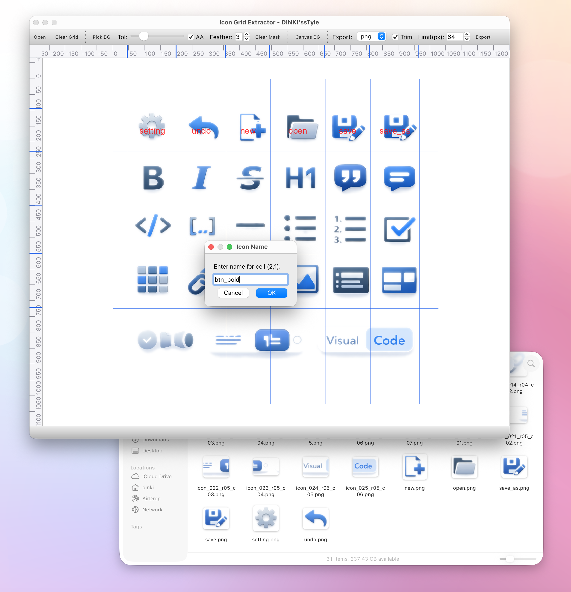

# Icon Grid Extractor
<p align="center">
  
</p>

**Icon Grid Extractor** is a Python-based GUI tool designed to easily extract individual icons or sprites from large image sheets.

It features an intuitive grid (ruler) system to partition images, supports transparent background removal (trim) and resizing, and allows batch saving in PNG or ICO formats. Your work state is automatically saved for future reuse.

## ✨ Key Features

*   **Image Viewer**: Canvas supporting smooth zoom (Ctrl+Wheel) and panning (Drag).
*   **Grid Slicing**:
    *   Click top/left rulers to create guidelines.
    *   Drag guidelines to adjust, right-click to remove.
*   **Background Removal (Masking)**:
    *   **Pick BG**: Select specific colors from the image to make them transparent.
    *   Adjust Tolerance and Feather for smooth edges.
*   **Cell Naming**:
    *   Double-click each cell to specify the export filename.
    *   Auto-naming based on coordinates if unspecified (`icon_001_r00_c01...`).
*   **Auto Save/Restore**:
    *   Generates a `.grid` file (JSON) in the same path as the image, saving grid positions, cell names, and options.
    *   Automatically loads the `.grid` file when opening the image.
*   **Export**:
    *   Supports **PNG / ICO**.
    *   **Trim**: Automatically removes transparent margins.
    *   **Limit**: Limits maximum pixel size (keeps aspect ratio).
*   **Drag & Drop**: Drag and drop image files directly onto the window to open.

## 🛠️ Requirements

This script runs on **Python 3.9+** and requires the following libraries:

*   **qtpy**: Qt binding abstraction (compatible with PyQt6, PyQt5, PySide6, etc.)
*   **PyQt6**: GUI framework (Recommended)
*   **numpy**: Fast image array processing
*   **Pillow (PIL)**: Image I/O and processing

### Installation

```bash
pip install qtpy PyQt6 numpy Pillow
```

## 🚀 How to Use

1.  **Run Script**:
    ```bash
    python icon_grid_extractor.py
    ```
2.  **Open Image**:
    *   Click `Open` or drag & drop an image file into the window.
3.  **Set Grid**:
    *   Click the top ruler to add **Vertical Lines (X)**, and the left ruler for **Horizontal Lines (Y)**.
    *   Drag lines to fine-tune positions, or right-click to delete.
4.  **Set Options (Optional)**:
    *   **Pick BG**: Enable this and click on the image background color to make it transparent.
    *   **Tol / Feather**: Adjust transparency tolerance and edge softness.
5.  **Name Cells**:
    *   Double-click the cell you want to extract to enter a filename. (Exclude extension)
6.  **Export**:
    *   Check `Format` (png/ico), `Trim`, and `Limit` options.
    *   Click `Export` and choose the output folder.
    *   Icon files are created in the folder, and the settings file (`.grid`) is saved in the original image folder.

## 📝 Configuration File (.grid)

Work progress is saved in a JSON-formatted `.grid` file.
This includes grid line coordinates, cell names, mask settings, and export options, allowing you to resume work at any time.

---

# Icon Grid Extractor (Korean)

**Icon Grid Extractor**는 큰 이미지 시트에서 아이콘이나 스프라이트를 개별 파일로 쉽게 추출할 수 있도록 도와주는 Python 기반 GUI 도구입니다.

직관적인 그리드(룰러) 시스템을 통해 이미지를 구획하고, 투명 배경 제거(trim) 및 리사이즈 기능을 사용하여 PNG 또는 ICO 포맷으로 일괄 저장할 수 있습니다. 또한 작업 상태를 저장하여 나중에 재사용할 수 있습니다.

## ✨ 주요 기능

*   **이미지 뷰어**: 부드러운 줌(Ctrl+휠) 및 패닝(드래그)을 지원하는 캔버스.
*   **그리드 슬라이싱**:
    *   상단/좌측 룰러를 클릭하여 가이드라인 생성.
    *   생성된 가이드라인은 마우스로 잡고 이동하거나 우클릭하여 삭제 가능.
*   **배경 제거 (Masking)**:
    *   **Pick BG**: 이미지의 특정 색상을 찍어 투명하게 처리.
    *   허용 오차(Tolerance) 및 부드러운 경계(Feather) 조절 가능.
*   **셀 명명 (Naming)**:
    *   각 칸을 더블 클릭하여 내보낼 파일 이름 지정.
    *   지정하지 않을 경우 위치 좌표 기반으로 자동 명명 (`icon_001_r00_c01...`).
*   **자동 저장/복원**:
    *   이미지와 동일한 경로에 `.grid` 파일(JSON)을 생성하여 그리드 위치, 셀 이름, 옵션 등을 저장.
    *   이미지를 열 때 `.grid` 파일이 있으면 자동으로 불러옴.
*   **내보내기 (Export)**:
    *   **PNG / ICO** 지원.
    *   **Trim**: 투명한 여백 자동 제거.
    *   **Limit**: 최대 픽셀 크기 제한 (비율 유지 리사이즈).
*   **드래그 앤 드롭**: 이미지 파일을 창에 끌어다 놓아 바로 열기.

## 🛠️ 요구 사항 (Requirements)

이 스크립트는 **Python 3.9+** 환경에서 실행되며 다음 라이브러리가 필요합니다.

*   **qtpy**: Qt 바인딩 추상화 (PyQt6, PyQt5, PySide6 등 호환)
*   **PyQt6**: GUI 프레임워크 (권장)
*   **numpy**: 고속 이미지 배열 처리
*   **Pillow (PIL)**: 이미지 입출력 및 처리

### 설치 방법

```bash
pip install qtpy PyQt6 numpy Pillow
```

## 🚀 사용 방법

1.  **스크립트 실행**:
    ```bash
    python icon_grid_extractor.py
    ```
2.  **이미지 열기**:
    *   `Open` 버튼을 누르거나, 이미지 파일을 창으로 드래그 앤 드롭합니다.
3.  **그리드 설정**:
    *   상단 룰러를 클릭해 **세로줄(X)**을 추가하고, 좌측 룰러를 클릭해 **가로줄(Y)**을 추가합니다.
    *   라인을 드래그하여 위치를 미세 조정하거나, 우클릭하여 삭제합니다.
4.  **옵션 설정 (필요 시)**:
    *   **Pick BG**: 배경을 투명하게 날리고 싶다면 버튼을 켜고 이미지 배경색을 클릭합니다.
    *   **Tol / Feather**: 투명화 강도 및 경계를 조절합니다.
5.  **셀 이름 지정**:
    *   추출할 칸을 더블 클릭하여 파일명을 입력합니다. (확장자 제외)
6.  **내보내기**:
    *   `Format` (png/ico), `Trim`, `Limit` 옵션을 확인합니다.
    *   `Export` 버튼을 눌러 저장할 폴더를 선택합니다.
    *   선택된 폴더에 아이콘 파일이 생성되고, 원본 이미지 폴더에는 설정 파일(`.grid`)이 저장됩니다.

## 📝 설정 파일 (.grid)

작업 내용은 JSON 형식의 `.grid` 파일로 저장됩니다.
이 파일에는 그리드 라인 좌표, 각 셀의 이름, 마스크 설정 및 내보내기 옵션이 포함되어 있어, 언제든 작업을 재개할 수 있습니다.

---
**(C) 2025 DINKI'ssTyle**
